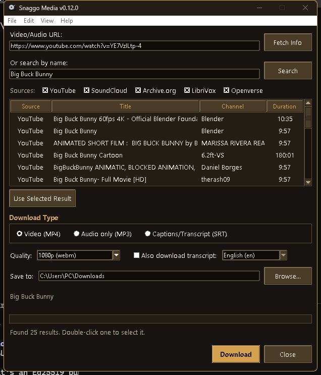

# Snaggo Media — Releases

## Why we built this

Every "video downloader" we tried wanted to sell us something, sneak in extra
software we never asked for, or bury the download button behind five ads. So
we built Snaggo Media: a clean, no-nonsense way to save audio and video from
the platforms we already use — no accounts, no ads, no upsells. Just a tool
that does one job well.

## What it does

- **Download video or audio** from YouTube, SoundCloud, Vimeo, Bandcamp, and
  more, via a simple paste-a-link or search-by-name workflow
- **Search across multiple sources at once** — YouTube, SoundCloud,
  Archive.org, LibriVox (public-domain audiobooks), and Openverse
  (CC-licensed audio from Jamendo, Wikimedia Commons, and Freesound) — with
  per-source opt-in checkboxes
- **Captions/transcripts** — download subtitles standalone, or bundle a
  transcript alongside your video/audio in one pass
- **Six selectable themes**, and your preferences (sources, download type,
  save folder) persist across restarts
- Donation addresses are cryptographically signed — the app checks their
  integrity on every launch and refuses to start if tampered with

## Downloads

Grab the latest installer from the [Releases](../../releases) page.

This repo holds published releases only — source code is developed in a
private repository.
